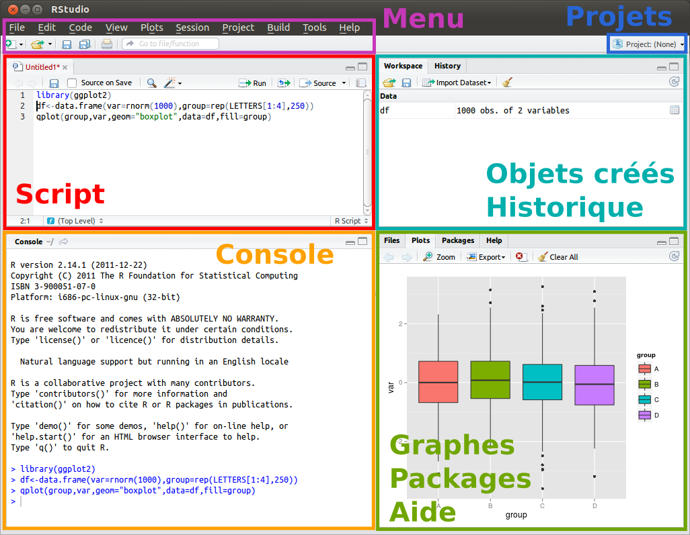

<style type="text/css">
.main-container {
  max-width: 1800px;
  margin-left: 10px;
  margin-right: 10px;
}
</style>

```{r, echo=F, message=F, error=F, warning=F}
knitr::opts_chunk$set(warning=FALSE, message=FALSE, error=FALSE, fig.width = 11, fig.height = 5)
library(xaringanExtra)
```

```{r xaringan-panelset, echo=FALSE}
xaringanExtra::use_panelset()
```


# Avant de commencer...

-> Vérification des installations et résolution des problèmes éventuels


-> Exprimez vos difficultés et incompréhensions pour éviter quelles s'accumulent


-> Jouez le jeu des exercices : c'est un moyen pour se familiariser avec l'écriture de R


-> **Document support à télécharger :** https://grisoudre.github.io/quantilille21_intror/support.html

Le support vous aide à suivre la formation, vous pouvez directement copier/coller les codes proposés. Il peut être téléchargé sur https://github.com/Grisoudre/quantilille21_intror. Le fichier .html contient l'ensemble de la présentation et s'ouvre via un nagivateur web (firefox, chrome, opera, etc).


## Mise en place de la session de travail


-> Dès maintenant, créez un dossier consacré à la formation, par exemple appelé "Quantilille 21 - intro R" :


  - Dans ce dossier, on anticipe l'accumulation de fichiers en créant les sous-dossiers suivants : **data** (données en input) et **output** (tableaux de résultats ou graphiques en export).
  

  - Dans le sous-dossier data, copiez les tables de données téléchargées : https://www.data.gouv.fr/fr/datasets/bases-de-donnees-annuelles-des-accidents-corporels-de-la-circulation-routiere-annees-de-2005-a-2019/ :
  
    + description-des-bases-de-donnees-onisr-annees-2005-a-2019.pdf
    + caracteristiques-2019.csv
    + lieux-2019.csv
    + vehicules-2019.csv
    + usagers-2019.csv


### Programme de la demi-journée (3h)

1. Présentation de R/Rstudio, de l'environnement de travail et du {tidyverse}
2. Importation des données
3. Exploration des données
4. Mise en forme et modification des données
5. Opérations sur les tables


## Données utilisées

Nous allons travailler sur des données portant sur les accidents de la route 2019 décrits par les forces de police : 
https://www.data.gouv.fr/fr/datasets/base-de-donnees-accidents-corporels-de-la-circulation/

En général, voici le type de fichiers qu'on reçoit lorsqu'on contacte les producteurs d'une enquête :

- Fichier de données brutes -> ici, les 4 fichiers .csv
- Dictionnaire des codes -> le fichier .pdf
- Questionnaire -> pas de questionnaire dans ce cas
- Documentation méthodologique -> le fichier .pdf

**Identifiants :**

Permettant de joindre les tables

+ **Num_Acc** : Identifiant **unique** de l'accident
+ **Num_veh** : Identifiant (non unique) véhicule, un accident peut concerner plusieurs véhicules
+ **id_vehicule** : Ajout de 2019, identifiant **unique** du véhicule


## Comment appréhender des tables de données ?


+ **"Logiciels clic-boutons"** : Excel, Excel Stat... et à un autre niveau SPAD, SPSS, Sphinx, ModaLisa. 

Interface avec menus et options évitant de passer par des lignes de commande. Facilité d'accès mais tâches répétitives et non enregistrées. Pas d'historique des actions effectuées. Problème de la reproductibilité et de la transférabilité des documents produits.

+ **Langages de programmation** : essentiellement Python, SAS, R, SPSS...

Chaque action est produite par une ligne de commande exécutée dans un IDE (environnement de développement intégré). Historique et reproductibilité garantis, plus de possibilités.

# Présentation de R/Rstudio, de l'environnement de travail et du {tidyverse}

 


## R

**= Langage "Brut"**

R est un dérivé gratuit (licence GNU GPL) du langage de statistique S. C'est un projet collaboratif et donc ouvert à tous. Il est entretenu par le R Development Core Team (CRAN). C'est un **langage** permettant de produire des statistiques descriptives comme des statistiques avancées. Ses fonctionnalités sont étendues ; il offre un large choix d'options graphiques. Il permet de développer ses propres fonctions et d'utiliser des fonctions développées par d'autres chercheurs, ingénieurs ou développeurs.

+ **Gratuit** et **opensource**
+ **Multi-plateformes** (Windows, Linux, OS X)
+ Produit **simplement** des statistiques avancées :
    + Statistiques descriptives, inférentielles
    + Représentations graphiques
    + Analyses factorielles
    + Modélisations
    + Analyses de réseaux
    + Cartographies, etc.
+ Grâce aux **"packages"** (extensions, bibliothèques de fonctions), les fonctionnalités sont très étendues et en font un langage complet


+ Importante **communauté** :
    + Tutoriels et aides sur le web
    + Développement constant de nouvelles fonctionnalités, interfaces et mises à jour régulières
+ **Reproductibilité** et **historique** : 
    + **Partager** simplement des **rapports commentés** (pdf, word, htlm, présentations) et **applications en ligne** ;
    + **Reproduire** et adapter des procédures et méthodes réalisées pour d'autres projets (ex : Rapports annuels);
+ Permet de ne pas subir des options par défaut sans les comprendre
+ **Compatible** avec d'autres langages, **exportations graphiques** avancées

***... Quelques inconvénients :***

+ Les fonctionnalités (et bibliothèques) sont très souvent mises à jour et nécessitent d'être maintenues.
+ Les fonctionnalités sont créées par les contributeurs et les syntaxes peuvent varier


## RStudio

**= Interface de développement**

La console diponible avec R est très rudimentaire (On utilise R dans le terminal sur linux), peu conviviable et devient complexe lorsque vous avez plusieurs fichiers et projets à gérer. 

Il est conseillé d'utiliser un logiciel offrant un espace de travail plus agréable et complet. **RStudio** est un environnement de développement pour l'écriture et la visualisation de scripts R. :

- Il est également **gratuit**
- Il offre un **éditeur de texte** (coloration donnant des repères, auto complétion, indentation)
- Permet un affichage **simultané** des scripts, sorties, fichiers, graphiques, aides
- Intègre une série de **modules** supplémentaires (Addins)
- Les fonctionnalités de **projets** facilitent l'accès aux dossiers (association entre la session de travail et les dossiers-cibles) et de façon plus avancée, la création d'applications et de rapports


## Téléchargements R/RStudio

**- (1) Téléchargement du langage R :**

https://cran.r-project.org/

puis "Downolad for..." en fonction du système d'exploitation ; faire bien attention à télécharger la version compatible avec la version de votre système d'exploitation (surtout sur mac, vérifier la compatibilité indiquée dans la colonne "latest release") 

**- (2) Télécharger et installer l'IDE RStudio :**

**RStudio** : https://www.rstudio.com/products/rstudio/download/#download : idem, faire attention à prendre la version correspondant au système d'exploitation


## Les packages

**= Bibliothèques de fonctions, env. extensions**


- **Packages** : Extensions ajoutées à votre session de travail, une fois installées et chargées. Les packages sont des **bibliothèques de fonctions** supplémentaires développées par d'autres personnes.

- Les packages "officiels" sont validés par la communauté de R (CRAN). Ils sont tous **accompagnés d'une documentation** (document pdf issu du site cran.r-project.org).


  - **1. L'installer (une seule fois, vous l'avez déjà fait avant la formation) :**
  

##### Pour installer un package validé par le CRAN :

```{r eval=F}
install.packages("tidyverse", dep=T)
```


##### Pour utiliser un package développé qui n'est pas sur un serveur-miroir du CRAN :

```{r, eval=F}
remotes::install_github("NomUtilisateur/NomPackage")
```

concrètement, on fait appelle au packages {remotes} en écrivant le nom du package puis **::** pour désigner qu'on utilise une fonction de ce package -> intérêt : évite de charger toutes les fonctions quand on en utilisera qu'une une seule fois.


*Cette étape d'installation des packages est délicate : R évoluant rapidement, la compatibilité entre les packages et entre les packages et la version utilisée de R n'est pas toujours garantie.*


  - **2. Le charger (à refaire pour chaque session) :**
      - En ligne de commande :
```{r eval=T, message=F, warning=F}
library(tidyverse)
library(questionr)
```


**/!\\ Il est préférable d'écrire ces lignes afin que les packages soient automatiquement définis et que les fonctions associées fonctionnent.**

**On recommande aussi de mettre ces lignes en début de script.**

*library() est équivalent à require()* que vous rencontrerez peut-être.


```{r, out.width = "450px", echo=F, fig.align="center"}
knitr::include_graphics("img/install_vs_library.jpeg")
```


## {tidyverse}


Une des limites du langage R est aussi une de ses qualités : la possibilité de créer et de diffuser des fonctions et des packages facilement implique que, selon les packages utilisés, la syntaxe peut varier.

Le package {tidyverse} regroupe d'autres packages complémentaires qui ont été pensés selon une syntaxe commune et qui commence à être largement partagée. C'est pourquoi, pour cette demi-journée, je vous présenterai essentiellement des fonctionnalités {tidyverse} au détriment du code en R {base}. Nous nous y intéressons particulièrement pour ses fonctionnalités de mise en forme des données. Les principaux "sous-packages" de {tidyverse} sont :

- `readr` : importation
- `tibble` : format des tableaux de données
- `forcats` : mise en forme des facteurs
- `stringr` : modification de chaînes de caractères
- `tidyr` et `dplyr` : mise en forme de tableaux
- `ggplot2` : graphiques


## Environnement de RStudio

On ouvre RStudio pour découvrir l'interface, puis on créera un projet associé aux dossiers et sous-dossiers qu'on vient de faire.


```{r, out.width = "650px", echo=F}
options( "digits"=7, "scipen"=0)
rm(list = ls())

```


- **Console** : Retour direct des instructions (**sans sauvegarde**). La console permet de vérifier que les lignes de commande ont bien été exécutées et de comprendre les erreurs éventuelles afin de les corriger.
**">" = prêt à recevoir des instructions.**

Instruction simple :
```{r instruction, eval=F}
1+1
```
Et touche Entrée

- **Script** : Zone d'écriture des instructions qui constitue le programme ou script qui sera **gardé en mémoire** (après sauvegarde)
Pour ouvrir un script : ctrl+shift+N / Fichier > new file > R script
```{r eval=F}
1+1
```
Sélectionner la ligne puis Ctrl + entrée ou bouton "Run". 
Ou "Source" pour tout exécuter


## Créer un objet dans R

Dans R, on manipule des **objets** qu'on crée directement dans l'interface/session. En fait, ce sont des objets virtuels qui n'existent que dans la session de travail, temps qu'on ne les exporte pas.

Pour créer un objet, on lui **donne un nom**, puis on écrit **<-** afin de signaler qu'on va définir un contenu à cet objet, enfin on **définit son contenu** :


```{r eval=F}
# Création d'une valeur
Objet <- 5
Objet <- Objet + 2
Objet + Objet
class(Objet)
# Création d'une chaîne de caractères
Texte <- "Mon texte"
# texte
class(Texte)
# Supprimer des objets :
rm(Texte, Objet)
```

**Attention :**

- Respect de la casse
- Ni accent, ni espace, ni caractère spécial en-dehors de "_"


Les objets peuvent être de différentes natures : chaîne de caractère, chiffre, suite d'éléments (vecteur), tableau, matrice, image, graphique, etc. Ils sont toujours accessibles par déclaration et créés/édités avec "<-"


## Utiliser des fonctions dans R

R est un langage orienté vers les objets qui sont au centre des manipulations produites. Les actions sont réalisées à l'aide de **fonctions** qui agissent sur des **objets**. Les fonctions sont déclarées par leurs noms et suivies de parenthèses : **fonction()**. A l'intérieur des fonctions, on déclare un ou plusieurs **arguments** : les **objets** et des **options**.

```{r}
A <- 14.5646
round(A, digits = 2)
```
où **round** est la fonction "arrondir", **A** l'objet - nécessairement numérique - à arrondir, **digits = 2** l'option "2 décimales".

Par défaut, notations anglosaxonnes (. ou décimales)


- **Objets** : Liste des objets créés (tableaux avec variables, listes, etc.)

- **Historique**

- **Fichiers** : Dossiers et fichiers

- **Graphiques** : Zoom, export

- **Aide** : Obtenir plus d'information sur une fonction, par exemple la fonction table() :
```{r eval=F}
?print
```

- **Menus** :
    - **Fichiers** : Nouveau fichier (script, présentation), ouvrir fichier, enregistrer, fichiers récents
    - **Outils** : Installer package (gmodels), options
    - **Session** : Actions sur la session de travail


**Enregistrer votre script : File > Save as...** et enregistrer le script dans le sous-dossier "scripts"


## Organiser son travail


Quand on entame un projet, les lignes de commande, scripts, tableaux créés et dossiers peuvent s'accumuler. Il est important d'organiser son travail dès le début.

**Gérer ses projets** : 

On crée un dossier par projet. Ce dossier est directement relié à votre projet et comporte des sous-dossiers "data", "output" comme nous l'avons déjà fait.

En haut à droite, une icône en forme de cube bleu permet de créer un **"nouveau projet"**. C'est un assistant de création d'un **dossier** dédié à un projet spécifique dans votre explorateur (windows, mac ou linux). Il sera associé à une **session de RStudio**, qui sera indépendante des documents et objets utilisés pour un autre projet.

ou bien **File > New Project > Existing directory** –> Browse > Sélectionnez votre dossier créé pour la formation > Create project

Un fichier **Nom_du_dossier.Rproj** apparaît dans le dossier, c'est le raccourci qui mènera à la session R. Un fichier **.RData** sera également créé et contiendra les objets présents dans l'environnement au moment de la fermeture de la session.


## Commentaires

Lire ou relire un programme, ce n'est pas lire un roman. Ca peut être fastidieux, surtout lorsque le programme n'est pas commenté.

Les commentaires permettent de comprendre la logique engagée sur une partie de programme, de préciser l'utilisation d'une fonction et d'organiser un script. Les commentaires sont précédés de **#** et ne sont pas exécutés.

Pour passer un ensemble sélectionné en commentaire (et inversement) : **ctrl+shift+c**.

Aérer le texte et mettre des titres facilitent aussi grandement la lecture de scripts : sur une ligne, **# Titre \-\-\-\- **


**Enfin, il y a plusieurs façons d'arriver à un résultat recherché ; Il s'agit déjà de comprendre ce qu'on fait. On préferera l'écriture la plus concise et compréhensible**


##  Présentation - En résumé

- RStudio est une interface de développement facilitant la gestion des scripts et des projets statistiques.

    -> Le script contient l'ensemble des instructions qu'on conservera
    
    -> La console renvoie les retours des instructions et divers messages (informations, erreurs) ; on peut y exécuter du script qui ne sera pas enregistré
    
- Les **projets** sont des sessions qu'on associe à un dossier :

    -> Vous retrouvez votre session : script, objets, recodages et transformations déjà effectués
    
    -> Renvoie directement à cet emplacement
    
    -> Evite de mélanger les données et scripts portant sur différents sujets
    
    -> Permet de partager l'ensemble du dossier


=> Veillez à :

Organiser vos différents scripts à l'aide des **sections** et **commentaires**

-> un·e futur·e vous ou un·e collègue doit pouvoir se replonger facilement dans le code

Ne laisser que le **code utile** ne comportant pas d'erreur ou d'instructions longues à exécuter et/ou inutile à exécuter (comme un install.packages). 

-> Jouez sur les zones **console** (retours et tests) et **script** (code enregistré). Dans l'idéal, vous devriez pouvoir exécuter l'ensemble du script sans erreur (le bouton "source" exécute l'ensemble du script dans l'ordre linéaire d'affichage et s'arrête à la première erreur).

-> Pour aller plus loin : voir le "Guide des bonnes pratiques", utilitR, Insee, https://www.pratiques.utilitr.org/index.html


# Importer des données


## Importations

On peut créer des objets en explicitant leur contenu comme on l'a fait. Mais en général, on ne saisit pas directement les données dans R, elles sont recueillies dans un fichier (contenu dans un dossier de votre ordinateur ou en ligne) qu'on importe dans R en créant un **nouvel objet**, en choisissant la **fonction de lecture et d'importation adéquate** et en indiquant **l'endroit où se trouve ce fichier**.

=> Le tableau est importé dans R. Ce qui signifie que toutes les opérations effectuées sur ces tableaux ne sont effectives que dans R et **ne modifient pas le fichier source**.

Le fichier source peut être en format :

  - Texte (.txt, .csv),
  - Tableur : Excel (xls, xlsx), Calc (.ods),
  - Tables issues de logiciels statistiques : SAS (.sas7bdat), SPSS (sav),
  - Format R : (.RData, .rds)
  - html, xml, json, etc.


Plusieurs **packages** facilitent l'importation directe de tableaux de données enregistrés dans divers formats (ex : package xlsx).


## Importer des fichiers textes (cvs, txt)

Les fichiers sont enregistrés en CSV dans le sous-dossier "data" : On indique le chemin "data/nom_fichier.csv" :

```{r import csv}
caracteristiques <-read.csv2("data/caracteristiques-2019.csv", 
                             fileEncoding = "UTF-8")
# argument nécessaire : "SousDossiers/NomFichier.csv"
# arguments qui peuvent être utiles :
# - fileEncoding = format d'encodage des caractères
# arguments par défaut :
# header = TRUE/FALSE : La première ligne correspond-elle aux titres des variables ?
# sep = "," : Choix du caractère séparant les cellules du tableau
# dec ="," : Choix du caractère des décimales
```

*Note :*

- `read.csv` quand le séparateur est une `,`
- `read.csv2` quand le séparateur est un `;`
- `read.table` pour les fichiers .txt et séparateur = `\t`


## Importer les 4 tables BAAC
 -> Sur ce modèle, importez les 3 autres tables BAAC : lieux, usagers et véhicules.


```{r import Deputes et Elections}
lieux <-read.csv2("data/lieux-2019.csv", 
                      fileEncoding = "UTF-8")
vehicules <-read.csv2("data/vehicules-2019.csv", 
                      fileEncoding = "UTF-8")
usagers <-read.csv2("data/usagers-2019.csv", 
                    fileEncoding = "UTF-8")
```


## Objet(s) R

### Un objet R

Fichier .rds :

```{r import r one,  eval=F}
readRDS("my_data.rds")
ChangementDeNom <- readRDS("my_data.rds")
```

### Plusieurs objets R

... Contenus dans un fichier .RData (ou .rda) :

```{r import r more,  eval=F}
load("data.RData") 
# Restaure un environnement (ensemble des objets)
# enregistré au préalable
```


## Tables d'autres logiciels statistiques (sas, spss)

Pour les bases de logiciels de statistiques (sas, spss, stata) : **Package {haven}** :
```{r import sas spss etc haven, eval=F}
library(haven)

# SAS
table <- read_sas("mtcars.sas7bdat")
write_sas(table, "mtcars.sas7bdat")

# Stata
table <- read_dta("mtcars.dta")
write_dta(table, "mtcars.dta")

# SPSS
table <- read_sav("mtcars.sav")
write_sav(table, "mtcars.sav")
```

Cf : https://github.com/tidyverse/haven


## Fichiers tableurs (xls, xlsx)

Pour les fichiers excel : **Package {readxl}** :
```{r import xls, eval=F}
library(readxl)
table <-read_excel("fichier.xlsx", sheet = 3) 
# ou read_xlsx
```

Fichiers dbf : **avec {foreign}**

```{r import dbf, eval = F}
library(foreign)
table <- read.dbf("mtcars.dbf", as.is = TRUE ) 
# as.is = TRUE pour modifier les variables qualitatives en factor
```


## Exporter des données

Format R (un objet) :
```{r export rdata, eval=F}
saveRDS(Table, "Table.rds")
Table <- readRDS("Table.rds")
```

Ensemble de l'environnement :
```{r sauver environnement, eval=F}
save(table1, table2, matrice, file = "mydata.RData")
# ou
save.image("mydata.RData") 
# note : .rda est équivalent à .RData
load("mydata.RData") 
# /!\ importe l'ensemble, même si les objets 
# existent déjà
```

Fichier texte :
```{r export csv, eval=F}
write.csv2(Table, "Table.csv",  na="", row.names = F)
write.table(Table, "Table.txt", sep="\t") 
# "clipboard" sous Windows pour copier 
# dans le presse-papiers
```


## Importation des données - En résumé

Suivant les types des données à importer (leur extension), différentes fonctions d'importation seront utilisées : 

- Pour les fichiers texte .csv : `read.csv2()` (;) ou `read.csv()` (,) ;
- Pour les fichiers txt : `read.table()`

Un package utile facilitant les importations et exportations (entre la session R et le dossier associé au projet) : `rio`, voir la <a href="https://cran.r-project.org/web/packages/rio/vignettes/rio.html">vignette de présentation</a>

# Exploration des données


## Premier aperçu d'une table

  
```{r}
head(usagers, 10)
# Aperçu des 10 1ères lignes (6 par défaut)
```


```{r}
dim(usagers) # dimension du tableau
names(usagers)#<< 
# Nom des variables
```


```{r}
str(usagers) 
# Nom, type des variables et premières observations

```


## Explorer une colonne nominale

### Modalités uniques

```{r}
unique(usagers$catu) # modalités uniques
class(usagers$catu) # type de la colonne
# n'ayant rencontré que des chiffres dans cette colonne,
# R l'interprète comme étant de type "integer" = "nombre entier"
```
*Remarques :* On pourrait vouloir modifier le type de la colonne et les valeurs affichées -> partie suivante


### Effectifs

```{r}
# Nombre d'observations pour chaque modalité :
table(usagers$sexe) 

# Ajout des NA : Non-attribués, sans valeur, s'il y en a :
table(lieux$v1, useNA="ifany") 

# Ajout de l'ensemble :
addmargins(
  table(usagers$sexe, useNA="ifany")
  ) 

```


### Pourcentages

```{r}
prop.table(
  table(usagers$sexe)
  )*100 # En pourcentages
round(
  prop.table(table(usagers$sexe))*100,
  1) # En pourcentages arrondis
```


```{r}
library(questionr)
freq(usagers$sexe, sort="dec",total=T) 
# sort="dec" pour trier par ordre décroissant,
# cum = T pour les %ages cumulés, total= T pour avoir le total,
# valid = F pour enlever la colonne val%

# Export :
resultat <- freq(usagers$sexe, sort="dec",total=T,valid=F)
write.csv2(resultat, "output/tap_sexe.csv") 
```


### Mise en pratique

-> Quelle est la répartition des catégories d'usagers parmi les personnes impliquées dans les accidents ?


```{r}
freq(usagers$catu, valid=F, sort="dec", total=T)
```


## Explorer une colonne numérique

### Indices de centralité et de répartition

```{r var quanti repartition}

# Moyenne :
mean(usagers$an_nais, na.rm=T)

# Moyenne arrondie :
round(
  mean(usagers$an_nais, na.rm=T),
  digits = 0)

# Moyenne tronquée :
trunc(
  mean(usagers$an_nais, na.rm=T),
  digits = 0)
```


```{r var quanti repartition deux}


# Médiane :
median(usagers$an_nais, na.rm = T)

# Quartiles, moyenne et nombre de non-attribués
summary(usagers$an_nais)

# Quantile (avec pas au choix)
quantile(usagers$an_nais, seq(0,1,.1), na.rm=T) # déciles
```


## Exploration des données - En résumé

- **Structure d'un tableau de données** : `names` pour les noms des variables, `str` pour les types des colonnes

- **Premières observations** d'un tableau : `head(tableau)` et d'une colonne ! `head(tableau$variable)`

- **Type d'une colonne** : `class(tableau$variable)`


- **Effectifs et poucentages sur une variable** avec `freq` : `freq(variable)`
- **Pourcentages** avec `prop.table`, `rprop` et `cprop` s'appliquant sur une table d'effectifs : `rprop(table(1èreVariable, 2èmeVariable))`

- **Indices de répartition** : `min`, `max`, `sd`, `mean`, `median` et `summary`.


# Mise en forme des données


## Recodages de modalités

Jusqu'ici, on dépend des choix de codage effectués par les producteurs des tables. Au fur et à mesure des explorations, certaines modifications peuvent se révéler intéressantes : 

  - modifier les codes par les libellés présentés dans le dictionnaire des codes, 
  - calculer l'âge au lieu d'utiliser l'année de naissance, 
  - ré-typifier une colonne qui aurait été mésinterpréter pour effectuer des calculs, 
  - compter le nombre de personnes impliquées pour chaque accident, 
  - relier les lignes des usagers à leurs accidents respectifs, etc.

La première opération consiste à recoder les variables dont les modalités apparaissent parfois en codes, pour un gain de place, comme c'est le cas ici.


### Recodage par assignation d'une variable nominale

Avec la syntaxe `tidyverse`, le recodage peut se faire terme à terme avec `fct_collapse`. Attention, cette fonction porte sur des variables de type `factor`, il faut s'assurer du type de la colonne - et éventuellement le corriger - avant :

```{r}
class(usagers$sexe)
usagers$sexe <- factor(usagers$sexe)
class(usagers$sexe)
```

- Modifier en réel entier (integer) : `as.integer()`

- Modifier en réel à décimales (numeric) : `as.numeric()`

- Modifier en variable binaire (logical) : `as.logical()`

- Modifier en date : `as.Date()`


Puis recodage à l'aide du dictionnaire des codes fourni dans la documentation et de la fonction `fct_collapse` :

```{r}
# sexe
usagers$sexe <- fct_collapse(usagers$sexe,
                           "Homme"="1",
                           "Femme"="2")
```

Il est possible de condenser ces deux opérations : Exemple avec le recodage de la colonne `grav` :

```{r}
# grav
usagers$grav <- fct_collapse(factor(usagers$grav),
                                 "Indemne"="1",
                                 "Tué" ="2",
                                 "Blessé hospitalisé"="3",
                                 "Blessé léger"="4")
levels(usagers$grav)
# levels() nous donne les différentes modalités
```

**=> De la même façon, recodez les variables `catu` et `traj`**


#### Recodage des variables `catu` et `traj`

```{r}
# catu
usagers$catu  <- fct_collapse(factor(usagers$catu),
                              "Piéton" = "3",
                              "Conducteur"="1",
                              "Passager"="2")

# traj
usagers$trajet <- fct_collapse(factor(usagers$trajet),
                                 "Domicile/travail ou école"=c("1","2"),#<<
                                 "Courses/achats"="3",
                                 "Utilisation professionnelle"="4",
                                 "Promenade/loisirs"="5",
                                 "Autre"="9",
                               "NR"=c("0","-1"))
# fct_collapse permet de recoder 2 valeurs en une unique
levels(usagers$trajet)
```


#### Recodages de la table Caractéristiques

```{r}
# Luminosité
caracteristiques$lum <- fct_collapse(factor(caracteristiques$lum),
                           "Jour"="1",
                           "Aube/crépuscule"="2",
                           "Nuit (sans écl.)"=c("3","4"),
                           "Nuit (avec écl.)"="5")
# Agglomération
caracteristiques$agg <- fct_recode(factor(caracteristiques$agg),
                           "Hors agglo."="1",
                           "En agglo."="2")

```


```{r}
# Conditions atmosphériques
caracteristiques$atm <- fct_recode(factor(caracteristiques$atm),
                         "Normales"="1",
                         "Pluie légère"="2",
                         "Pluie forte" ="3",
                         "Neige, grêle"="4",
                         "Brouillard"="5",
                         "Vent fort, tempête"="6",
                         "Temps éblouissant"="7",
                         "Temps couvert"="8",
                         "Autre" = "9")


```


### Calculs sur les variables

```{r}
# /!\ 2 valeurs "aberrantes" :
usagers$an_nais <- na_if(usagers$an_nais,1900)
usagers$an_nais <- na_if(usagers$an_nais,1901)
 
```

na_if transforme une modalité en NA = non-attribué. Les valeurs `NA` sont spécifiques. is.na() permet de les mettre en évidence :

```{r}
is.na(c(NA, "NA"))
```

**Calcul de l'âge à partir de l'année de naissance :**

```{r}
usagers$age <- 2019 - as.integer(usagers$an_nais)

```

`-` soustraction, `+` addition, `/` division, `*` multiplication...


### Création de catégories

```{r}
# Selon une séquence définie :
seq(0,10,1)
# = séquence allant de 0 a 10 avec un pas de 1
usagers$age_classe <- cut(usagers$age, seq(0,110,10), 
                                    right=F)#<< 
# right = F permet de borner à l'inférieur et non au supérieur
```


### Recodages conditionnels : créer de nouvelles variables à partir de celles existantes

2 fonctions principales permettent de recoder des variables sur conditions :

- `ifelse(condition, si condition remplie, si condition non remplie)` :

Créer une variable qui distingue les accidents ayant eu lieu dans les Hauts-de-France :
```{r}
caracteristiques$HdF <- ifelse (caracteristiques$dep %in% c("59","62","80","60","2"), # condition
                      "Hauts de France", # Valeur si condition remplie
                      "Hors Hauts de France") # Valeur si non
freq(caracteristiques$HdF)
```


- `case_when( conditions 1 ~ effet de la condition 1 , condition 2 ~ effet de la condition 2 ,etc, TRUE ~ effet si aucune condition n'est remplie)`

Permet d'enchaîner plusieurs conditions à la suite. Exemple avec l'heure à laquelle a eu lieu l'accident :


```{r, eval = T}
# A quoi ressemblent les valeurs ?
head(caracteristiques$hrmn)
```


**Proposition : une fois supprimé les ":", on transforme la colonne en type numérique**


```{r, eval = T}
caracteristiques$hrmn <- gsub(":","",caracteristiques$hrmn)

caracteristiques$hrmn <- as.numeric(caracteristiques$hrmn)

# Puis, on applique des conditions pour distinguer différentes tranches horaires ;

caracteristiques$hrmnCl <- case_when(caracteristiques$hrmn < 600 ~ "00h-05h59",
                          caracteristiques$hrmn < 1000 ~ "06h-09h59",
                          caracteristiques$hrmn < 1400 ~ "10h-13h59",
                          caracteristiques$hrmn < 1700 ~ "14h-16h59",
                          caracteristiques$hrmn < 2000 ~ "17h-19h59",
                          caracteristiques$hrmn < 2400 ~ "20h-23h59",
                          T ~ "")
```


#### Utiliser les conditions

**Opérateurs utiles :**

- == : Egalité (A == B signifie "A est égal à B")
- != : Exclusion ( A != B signifie "A est différent de B")
- < , > , <= , >= : inférieur, supérieur, inférieur ou égal, supérieur à égal
- %in% : appartient à

**Enchaînements de plusieurs conditions :**

- | : Ou bien
- & : Et


### Exercice : Recodez la catégorie de véhicule de la table Véhicules

Les modalités pourront être : non-motorisé, 2-roues motorisées, voiture, poids lourd et trains


```{r}
# freq(vehicules$catv)
vehicules$catv_rec <- case_when(vehicules$catv %in% c(1,50,60,80) ~ "Non-motorisé",
                                vehicules$catv %in% c(2,3,30:36,41:43) ~ "2-roues motorisées, voiturette",
                                vehicules$catv %in% c(7,10) ~ "Voiture",
                                vehicules$catv %in% c(13:21,37:40) ~ "Poids lourd, train",
                                T ~ "NR")
freq(vehicules$catv_rec, sort="dec",valid=F, total=T)
```


## Sélections, filtres et tris

Suivant ce qu'on recherche, on peut souhaiter à ne conserver que certaines colonnes ou lignes d'un tableau (lorsqu'on s'intéresse à une sous-population par exemple).


### Sélection de colonnes `select`
```{r}
 # Sélections de colonnes relatives aux dates,
# dans la table caracteristiques :
Date <- select(caracteristiques, Num_Acc, mois, jour, hrmn)
```

avec `caracteristiques` (tableau de données) en 1er argument puis les colonnes qu'on souhaite conserver séparées par une ",".


### Sélection de lignes par position : `slice`
```{r}
# 4 premières lignes :
slice(usagers,1:4) 
```


### Sélection de lignes par conditions, ou filtres : `filter`
```{r}

usagersPietons <- filter(usagers, catu=="Piéton")
```

la table `usagersPietons` ne contient plus que les lignes concernant les piétons.


### Trier des données : `arrange`
```{r}
usagers <- arrange(usagers, desc(age))
# desc() pour trier par ordre décroissant
```


### Mise en pratique

-> A l'aide des fonctions que nous venons de voir, présentez l'âge, la gravité de l'accident et la catégorie d'usagers des 2 hommes les plus âgés qu'on retrouve dans les données BAAC 2019.


Plusieurs solutions :

On peut encaster les fonctions ou les écrire à la suite.

```{r}
slice(
  select(
    arrange(
      filter(
        usagers, # Table de départ
        sexe=="Homme"), # condition du filter
      desc(age)), # tri de l'arrange
    age, grav, catu), # colonnes du select
  1:2) # lignes du slice
```
... il faut lire de l’intérieur vers l’extérieur, difficile de voir les arguments associés à chaque fonction.


Ou bien
```{r}
exo <- filter(usagers, sexe=="Homme")
exo <- arrange(exo, desc(age))
exo <- select(exo, age, grav, catu)
exo <- slice(exo, 1:2)
exo
```
Création d'un objet intermédiaire qui n'est pas si nécessaire.


Un opérateur rend plus lisibles les enchainements de ce type


## L'opérateur ` %>% ` (pipe)

L'opérateur `%>%` (*pipe*, ctrl+shift+m) permet d’enchainer les fonctions en prenant dans chaque fonction le résultat de la fonction précédente comme argument principal : `f(a)` s’écrit `a %>% f()` ; Ce qui est à gauche de ` %>% ` est basculé en premier argument de ce qui suit l'opérateur.

table %>% 
fonction1() %>% 
fonction2()

au lieu de fonction2(fonction1(table))

Ce qui, pour l'exemple, donne :

```{r}
usagers %>% 
  filter(sexe=="Homme") %>% 
  arrange(desc(age)) %>% 
  select(age, grav, catu) %>% 
  slice(1:2)
```


## Mise en forme des données - En résumé

#### Recodage de variable nominale pas assignation

- Transformer la colonne en type `factor` :
```{r}
usagers$grav <- factor(usagers$grav)
```

- Recoder terme à terme avec `fct_collapse` :
```{r}
usagers$grav <- fct_collapse(usagers$grav,
                                 "Indemne"="1",
                                 "Tué" ="2",
                                 "Blessé hospitalisé"="3",
                                 "Blessé léger"="4")
```

- Sortir les modalités recodées avec `levels`

```{r}
levels(usagers$grav)
```


#### Recodages conditionnels : créer de nouvelles variables à partir de celles existantes

2 fonctions principales permettent de recoder des variables sur conditions :

- `ifelse(condition, si condition remplie, si condition non remplie)` :

- `case_when( conditions 1 ~ effet de la condition 1 ,
condition 2 ~ effet de la condition 2,
etc,
TRUE ~ effet si aucune condition n'est remplie)`


#### Sélections, filtres et tris

Les principales fonctions permettant de réarranger les tables via tydiverse sont :

- `select(table, colonnes à conserver)` : Sélection de colonnes
- `filter(table, condition du filtre)` : Sélection de lignes
- `arrange(table, colonnes sur laquelle faire le tri, desc(2ème colonne sur laquelle faire un tri décroissant))` : Tri de la table
- `slice(table, position des lignes à conserver)` : Sélection de lignes selon leur position

- L'opérateur `%>%` (*pipe*, ctrl+shift+m) permet d'enchaîner des fonctions : `f(a)` s’écrit `a %>% f()`.

# Opérations sur les tables


## Regroupements de lignes

Il peut être intéressant de regrouper plusieurs observations selon un ou plusieurs critères afin de produire des calculs. La fonction `group_by` produit ces regroupements et est nécessairement associée à une fonction de calcul dans `summarise`.

### Exemple 1 : Compter le nombre d'usagers moyen par accident

```{r}
NbUsagers <- usagers %>% 
  group_by(Num_Acc) %>% #<<
  summarise(NbUsagers = n()) #<<
# n() compte le nombre de lignes
mean(NbUsagers$NbUsagers)
```


### Mise en pratique

-> Exemple 2 : De la même façon, quel est le nombre maximum de véhicules impliqués ?


```{r}
NbVehicules <- vehicules %>% 
  group_by(Num_Acc) %>% 
  summarise(NbVehicules = n())

max(NbVehicules$NbVehicules)

```


### Exemple 3 : Moyenne d'âge et nombre de personnes impliquées par accident

En ne présentant que les 6 premières observations :

```{r}

usagers %>% 
  group_by(Num_Acc) %>% 
  summarise(AgeMoy = mean(age),
            NbPers = n()) %>% 
  head(6) # pour ne sortir que les 6 premières observations
```


## Jointures de tables

Les données sur les accidents sont organisées en plusieurs tables relatives à plusieurs unités statistiques (l'événement "accident" des tables caractéristiques et lieux, les véhicules impliqués et les usagers impliqués). 

On remarque d'ailleurs que le nombre d'observations pour les tables de chaque type d'unité varie. Il est toutefois possible de les regrouper si on dispose d'une clé d'appariemment ou variable de jointure (une variable commune à deux tables permettant d'associer les accidents avec les personnes et les véhicules concernés).

### Exemple 1 : Jointure des tables "Caractéristiques" et "lieux" :

Pas de problème d'unité puisque c'est la même :

```{r}
Accident <- left_join(x = caracteristiques, y = lieux, by = "Num_Acc")
```

Les 2 tables ont le même nombre de lignes et les identifiants "Num_Acc" sont uniques (un numéro n'apparait qu'une fois dans chacune des tables). `left_join` "envoie" les données de la table y dans la table x en associant les lignes ayant le même "Num_Acc".


### Exemple 2 : Ajout des caractéristiques de l'accident dans la table usagers

En revanche, ici, il faut faire un choix car plusieurs usagers peuvent être concernés par un même accident. On peut ajouter les informations de l'accident à la table usagers et non l'inverse.

```{r}
usagers <- left_join(x = usagers, y = Accident, by = "Num_Acc")
```

L'écriture est la même mais le choix de l'ordre de déclaration des tables compte : On a bien conservé l'unité "usagers" dans laquelle on a "injecté" les informations relatives aux accidents respectifs. Concrètement, un même accident apparait sur autant de lignes qu'il y a eu d'usagers impliqués.


### Précisions

Attention, on ne peut joindre que 2 tables à la fois.

**les fonctions join :** Nous avons vu la fonction `left_join`, il existe aussi :

- `right_join` : Ajout des informations de la table x vers la table y
- `inner_join` : Conserve les lignes présentes dans les deux tables
- `full_join` : Conserve l'ensemble des lignes des deux tables
- `anti_join` : Conserver les lignes qui ne se retrouvent que dans une des deux tables
- `by = c("a" = "b")` : Si les noms des colonnes sont différents dans les deux tables
- `by = c("a1" = "a2", "b1" = "b2")` : Si plusieurs colonnes de jointure avec des noms différents


## Opérations sur les tables - En résumé

La fonction `group_by` permet de **produire des regroupements** et est associée à une fonction de calcul dans `summarise`.


**Pour joindre des tables** (et produire des calculs sur des colonnes issues de 2 tables différentes), il faut :

- Les noms des tables
- Le ou les noms de la ou des colonnes d'appariemment (clés de jointure)
- Identifier les unités statistiques des tables et décider de la table ou des tables dont on conservera la/les structure(s)


Voir la cheatsheet sur `dplyr` et `tidyr` : https://thinkr.fr/pdf/dplyr-french-cheatsheet.pdf


# ... Poursuivre l'exploration des données


## Croiser deux variables nominales

```{r}
# Effectifs :
addmargins(table(usagers$sexe, usagers$catu))

# Pourcentages :

prop.table(table(usagers$sexe, usagers$catu),1) # 2 en colonnes

```


```{r}
# Arrondi :
round(
  prop.table(table(usagers$sexe, usagers$catu),1)*100,
  1)

# avec questionr :
rprop(table(usagers$sexe, usagers$catu)) 
# cprop en colonnes et prop pour les pourcentages totaux
```


#### Mise en pratique

- Quelle est la gravité des accidents pour les piétons selon l'heure de la journée ?


```{r}
Pietons <- usagers %>% filter(catu=="Piéton")
rprop(table(Pietons$hrmnCl, Pietons$grav))
```


## Croiser une variable numérique et une nominale

**...en utilisant `group_by` et `summarise` :**

```{r}
usagers %>% 
  group_by(catu) %>% 
  summarise(min = min(age, na.rm = T),
            max = max(age, na.rm = T),
            mean = round(mean(age, na.rm = T), 1),
            mediane = median(age, na.rm = T))
```


## Mise en pratique

-> Quel est l'âge médian des conducteur·rices selon le type de trajet qu'ils et elles effectuaient au moment de l'accident ?


```{r}
usagers %>% 
  filter(catu=="Conducteur") %>% 
  group_by(trajet) %>% 
  summarise(AgeMedian = median(age, na.rm=T)) %>% 
  arrange(AgeMedian)
```


# Ressources


**R généralités :**

- Larmarange, Joseph, et alii. "Introduction à l’analyse d’enquêtes avec R et RStudio", s.d.
  https://larmarange.github.io/analyse-R/ 
  
- Larmarange, Joseph. "Webin-R", s.d. https://larmarange.github.io/webin-R/
  
- Barnier, Julien. "Introduction à R et au tydiverse", https://juba.github.io/tidyverse/
  
- Guay, Jean-Herman. *Statistiques en sciences humaines avec R: sciences sociales et psychologie.* [Louvain-la-Neuve]; [Québec]: De Boeck ; [Presses universitaires de Laval], 2014.

- R for data science : https://r4ds.had.co.nz/

- Nathaniel D. Phillips, YaRrr! The Pirate’s Guide to R : https://bookdown.org/ndphillips/YaRrr/

- Insee, utilitR, "Guide des bonnes pratiques" : https://www.pratiques.utilitr.org/index.html

- Insee, utilitR, Documentation collaborative à destination des agents de l'Insee, https://www.book.utilitr.org/

**Cheat Sheet : https://www.rstudio.com/resources/cheatsheets/ **

- Rstudio : https://github.com/rstudio/cheatsheets/raw/master/rstudio-ide.pdf
- Readr : https://github.com/rstudio/cheatsheets/raw/master/data-import.pdf
- stringr : https://github.com/rstudio/cheatsheets/raw/master/strings.pdf
- dplyr : https://github.com/rstudio/cheatsheets/raw/master/data-transformation.pdf
- ggplot2 : https://github.com/rstudio/cheatsheets/raw/master/data-visualization-2.1.pdf


**Aides en ligne et sites ressources :**

- http://stackoverflow.com/ : Large source d'informations, anglophone
  
- http://forums.cirad.fr/logiciel-R/ : Francophone
  
- http://www.statmethods.net/ : Quick-R
  
- http://rfunction.com/

- http://informatique-mia.inra.fr/r4ciam/
  
- https://cran.r-project.org/web/views/ : Packages du CRAN


**Quelques # et @ twitter "actifs" :**

- `#rstats`
- `#rstatsFR`

- @icymi_r
- @rgeomatic
- @hadleywickham
- @thinkR_fr


